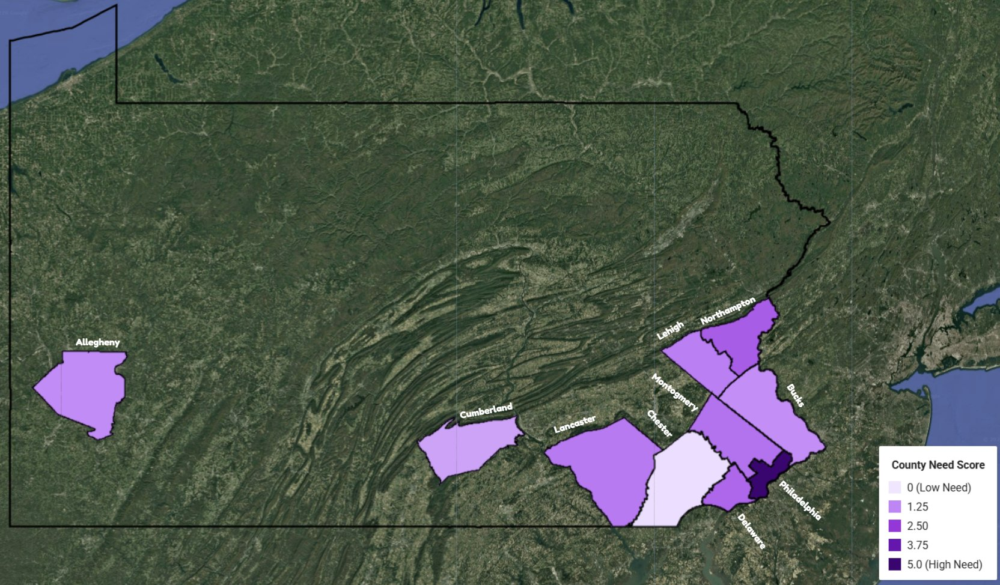
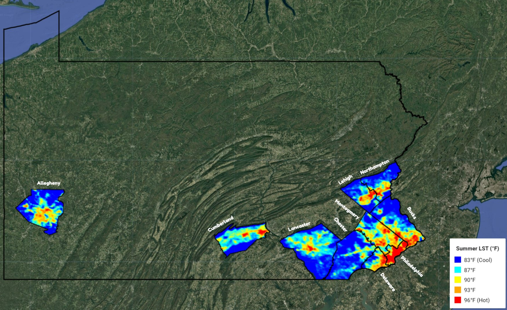
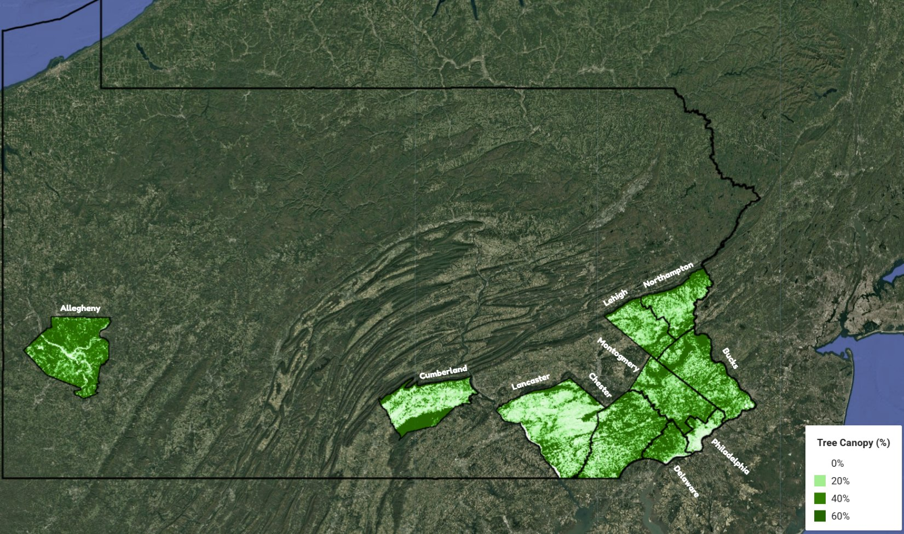
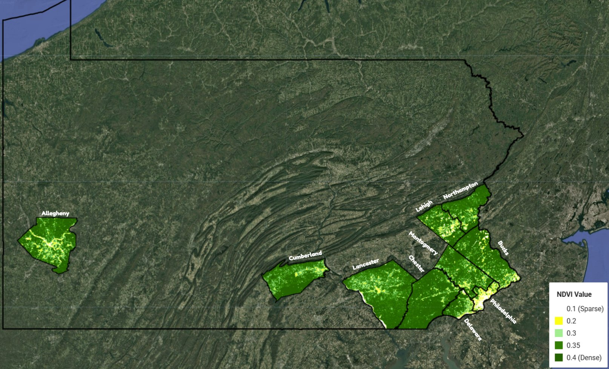
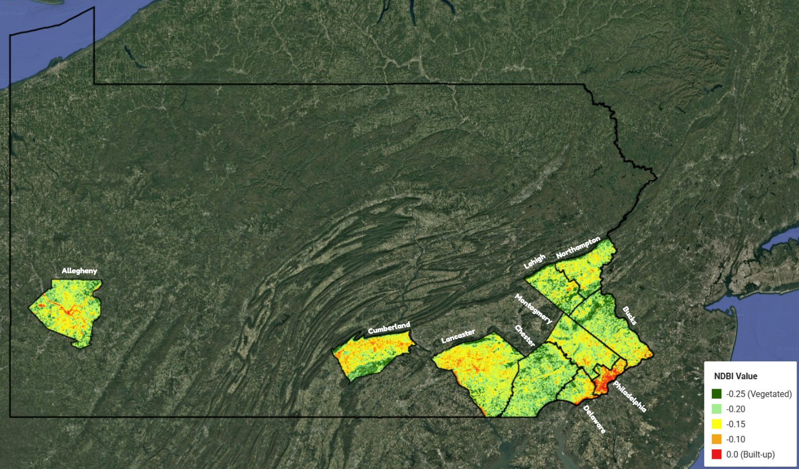
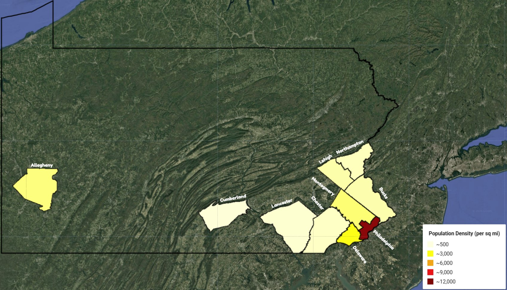

# Urban Heat Islands in Pennsylvania

Our TSA Geospatial Technology project for the 2026 National Conference in National Harbor, MD. We placed 4th in the nation.

We used satellite data and census data to figure out which Pennsylvania counties are hit hardest by urban heat, scored them on how much they need help, and came up with cooling plans for the five that need it most.



## Background

The 2026 prompt asked teams to find urban heat island hotspots in their area using temperature, vegetation, and land use data, and then propose fair solutions like tree planting, reflective surfaces, or cooling centers.

Part of why we picked this topic is personal. Someone close to our team had an electrical failure at home caused by extreme heat, and it started a fire. We wanted to understand what actually makes some places so much hotter than others.

Our research question:

*How do vegetation coverage, land use intensity, and population density relate to urban heat island intensity across Pennsylvania counties, and what cooling solutions would help the most affected areas?*

## How we did it

1. Pulled summer land surface temperature (June to August, 2020 to 2025) for every PA county from NASA's MODIS satellite in Google Earth Engine, and kept the 10 hottest.
2. For those 10 counties, collected four more indicators: tree canopy cover, NDVI, population density, and NDBI.
3. Scaled each indicator from 0 to 1 using min-max normalization, so 1 always means worst.
4. Added the five scores together to get a County Need Score out of 5.
5. Took the top five counties and matched interventions to whatever was driving their score.

### The five indicators

| Indicator | What it tells us | Data source |
|---|---|---|
| Land surface temperature (LST) | How hot the ground gets in summer | NASA MODIS Terra (MOD11A1), 2020–2025 |
| Tree canopy cover | Percent of the county shaded by trees | USGS NLCD Tree Canopy, 2023 |
| NDVI | How dense and healthy the vegetation is | Landsat 8, summer 2024 |
| Population density | How many people live there per square mile | 2020 U.S. Census |
| NDBI | How much of the land is roads, roofs, and pavement | Landsat 8, summer 2024 |

For LST, population density, and NDBI, higher is worse, so we used `(x - min) / (max - min)`. For tree canopy and NDVI, higher is better, so we flipped it: `(max - x) / (max - min)`. Every indicator is weighted equally.

We used Google Earth Engine (JavaScript) for the satellite data, Python with pandas for the scoring, and Excel for cleaning.

## Results

### Raw data

| County | LST (°F) | Canopy (%) | NDVI | People / sq mi | NDBI |
|---|---:|---:|---:|---:|---:|
| Philadelphia | 95.26 | 19.44 | 0.1942 | 11,736.88 | -0.0776 |
| Montgomery | 88.68 | 40.44 | 0.3532 | 1,820.12 | -0.1758 |
| Delaware | 88.54 | 32.55 | 0.3573 | 3,181.47 | -0.1959 |
| Bucks | 86.03 | 42.99 | 0.3491 | 1,075.82 | -0.1752 |
| Lehigh | 85.56 | 40.73 | 0.3427 | 1,117.29 | -0.1890 |
| Allegheny | 85.07 | 45.62 | 0.3490 | 1,677.90 | -0.1612 |
| Cumberland | 84.90 | 47.42 | 0.3512 | 496.30 | -0.1716 |
| Lancaster | 84.80 | 33.37 | 0.2945 | 596.83 | -0.1561 |
| Northampton | 84.63 | 34.88 | 0.2409 | 873.72 | -0.1330 |
| Chester | 84.03 | 53.41 | 0.3652 | 747.15 | -0.1860 |

### County Need Scores

| County | LST | Canopy | NDVI | Density | NDBI | Score |
|---|---:|---:|---:|---:|---:|---:|
| Philadelphia | 1.000 | 1.000 | 1.000 | 1.000 | 1.000 | 5.000 |
| Northampton | 0.053 | 0.545 | 0.727 | 0.034 | 0.532 | 1.891 |
| Lancaster | 0.069 | 0.590 | 0.413 | 0.009 | 0.336 | 1.417 |
| Delaware | 0.402 | 0.614 | 0.046 | 0.239 | 0.000 | 1.301 |
| Montgomery | 0.414 | 0.382 | 0.070 | 0.118 | 0.170 | 1.154 |
| Allegheny | 0.093 | 0.229 | 0.095 | 0.105 | 0.293 | 0.815 |
| Bucks | 0.178 | 0.307 | 0.094 | 0.052 | 0.175 | 0.806 |
| Lehigh | 0.136 | 0.373 | 0.132 | 0.055 | 0.058 | 0.755 |
| Cumberland | 0.077 | 0.176 | 0.082 | 0.000 | 0.205 | 0.541 |
| Chester | 0.000 | 0.000 | 0.000 | 0.022 | 0.084 | 0.106 |

These are the scores you get from running `analysis/county_need_score.py` on the raw data above. A few normalized values in Table 6 of our competition portfolio came out slightly different. The top five counties are the same either way, just in a different order after Northampton.

### What we found

Philadelphia had the worst value of all ten counties on every single indicator, which is why it maxed out at 5.0. That means about 1.6 million people are living in the hottest, least shaded, most paved county in our study.

Philadelphia and Chester are in the same part of the state and get basically the same weather, but Philadelphia's summer ground temperature was 11.2°F higher. The biggest difference between them is trees: Chester has 53% canopy cover and Philadelphia has 19%.

Northampton surprised us. Its population density is pretty moderate, but it has the second most built-up land and the second weakest vegetation, which put it at #2 overall. So heat risk isn't only a big-city problem.

Chester and Cumberland are both in the top 10 hottest counties, but they ended up with the lowest need scores because they have a lot of trees and not many people packed together.

## Maps

All six maps were made in Google Earth Engine using the scripts in `gee/maps/`.

| Land surface temperature | Tree canopy |
|---|---|
|  |  |
| NDVI | NDBI |
|  |  |
| Population density | County need score |
|  |  |

## What we proposed

We didn't want to give every county the same fix, so each plan targets whatever was hurting that county's score the most.

- Philadelphia: a large tree planting program in neighborhoods and along major roads, reflective roofs on commercial and city buildings, cooling centers spread evenly across the city, and permeable pavement.
- Northampton: green streets (planted medians, street trees, and bioswales) plus reflective roofs in industrial and commercial areas.
- Lancaster: reflective surfaces on farm and commercial buildings, and green streets along main transportation routes.
- Delaware: tree planting where canopy is lowest, and cooling centers in the densest neighborhoods.
- Montgomery: green street corridors that connect existing green space, and permeable pavement in commercial zones.

Looking ahead to 2035, if nothing changes, we estimate Philadelphia's summer ground temperature could reach around 96 to 97°F. If the plans above were carried out (for example, getting Philadelphia to about 30% canopy), we estimate a 2 to 3°F drop there and roughly a 15 to 25% drop in need scores across the five counties. The reasoning behind these numbers is in the [full portfolio](docs/portfolio.pdf).

## Repo layout

```
analysis/county_need_score.py   scoring script
data/raw/                       indicator values for all 10 counties
data/processed/                 output from the scoring script
docs/portfolio.pdf              our full competition portfolio
figures/                        maps and charts
gee/indicators/                 Earth Engine scripts that pull the county values
gee/maps/                       Earth Engine scripts that make the maps
```

## Running it yourself

### Earth Engine scripts

You'll need a free [Google Earth Engine](https://earthengine.google.com/) account. Open the [Code Editor](https://code.earthengine.google.com/), paste in one of the scripts from `gee/indicators/`, and hit Run. The results show up in the Console tab. Start with `01_lst_top10.js`, since that's what picks the 10 counties.

The scripts in `gee/maps/` draw each map and set up an export. To save a map, go to the Tasks tab and click Run next to it, and the image goes to your Google Drive.

### Scoring script

```bash
git clone https://github.com/rpatel-23/pa-urban-heat-island-analysis.git
cd pa-urban-heat-island-analysis
pip install -r requirements.txt
python analysis/county_need_score.py --plot
```

This prints the ranked scores, saves them to `data/processed/county_need_scores.csv`, and makes a bar chart in `figures/`.

## Limitations

Since we only compared 10 counties, the scores are relative to each other. Philadelphia getting 5.0 means it was the worst of this group, not that it hit some fixed danger level.

We weighted all five indicators equally. It would be interesting to test different weights and see how much the rankings move.

We computed NDVI and NDBI from raw Landsat values without applying the official scale factors or masking out clouds. Doing both would give more standard values, and it's the first thing we'd fix next time.

County averages also hide what's happening block by block. Redoing this at the census tract level, with income and age data included, would show which neighborhoods need help the most.

## Team

- Rishabh Patel (RP): Project lead. Wrote the Earth Engine scripts and the
  County Need Score code, built the maps, and wrote most of the analysis.
- Advik Kashyap (AK): Data verification, research, and infographic design.
- Ahaan Nigam (AN): Map analysis, predictions section, and portfolio editing.

Advisor: Kevin Parks, Downingtown East High School TSA

## Sources

The full reference list is in the [portfolio](docs/portfolio.pdf). The main data and papers we used:

- Gorelick, N., et al. (2017). Google Earth Engine: Planetary-scale geospatial analysis for everyone. *Remote Sensing of Environment, 202*, 18–27. https://doi.org/10.1016/j.rse.2017.06.031
- Wan, Z., et al. (2015). MOD11A1 MODIS/Terra Land Surface Temperature/Emissivity Daily L3 Global 1km SIN Grid V006. NASA LP DAAC. https://doi.org/10.5067/MODIS/MOD11A1.006
- Homer, C., et al. (2023). NLCD 2023 USGS Tree Canopy Cover (CONUS) v2023.5. U.S. Geological Survey. https://doi.org/10.5066/P94XDKTE
- Bowler, D. E., et al. (2010). Urban greening to cool towns and cities: A systematic review of the empirical evidence. *Landscape and Urban Planning, 97*(3), 147–155. https://doi.org/10.1016/j.landurbplan.2010.05.006
- Akbari, H., Menon, S., & Rosenfeld, A. (2009). Global cooling: Increasing world-wide urban albedos to offset CO2. *Climatic Change, 94*(3–4), 275–286.
- Parsons, L. A., et al. (2023). Higher temperatures in socially vulnerable US communities increasingly limit safe use of electric fans for cooling. *GeoHealth, 7*(8). https://doi.org/10.1029/2023GH000809
- U.S. Census Bureau. (2020). 2020 Decennial Census.

## License

The code is under the MIT License. The satellite data comes from NASA and USGS, and the population data comes from the U.S. Census Bureau.
